<h1 align="center">GitHub Code Analyzer</h1>

<p align="center">
  
  
  
  
</p>

<p align="center"><strong>AI-assisted commit analytics, sprint leaderboards and team dashboards for GitHub repositories.</strong></p>

GitHub Code Analyzer is the web client (plus a thin API proxy) for the SprintGit platform. You sign in with GitHub, connect repositories, and the platform scores every commit with an AI reviewer. Scores roll up into per-user, per-team and per-sprint rankings, so a hackathon organiser, a bootcamp instructor or an engineering lead can run a time-boxed "sprint", watch teams compete, and drill into any single commit to see what was good, what was risky and what to do next.

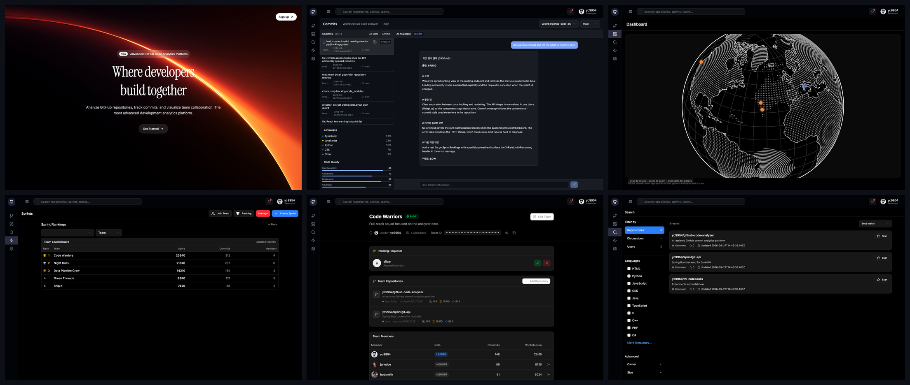

## Table of contents

- [Overview](#overview)
- [Features](#features)
- [Screenshot walkthrough](#screenshot-walkthrough)
- [Architecture](#architecture)
- [API reference](#api-reference)
- [Tech stack](#tech-stack)
- [Getting started](#getting-started)
- [Project structure](#project-structure)
- [Development notes](#development-notes)
- [Project status](#project-status)
- [Roadmap](#roadmap)
- [License](#license)

## Overview

The repository contains two applications that are started together with `npm run dev`:

| Part | Location | What it does |
| --- | --- | --- |
| Frontend | `src/` | Vite + React 18 single-page app. Eleven routes across ten pages, a shadcn/ui + Radix component library, D3 globe, Recharts. Talks to the SprintGit REST API with a JWT bearer token. |
| Backend | `server/` | Next.js 16 app that exposes `server/app/api/**` route handlers. Most routes are a CORS-friendly proxy to `https://api.sprintgit.com`; a few call the GitHub REST API directly and one calls OpenAI for chat. |

The analysis itself (cloning, scoring, ranking, notifications) happens in the upstream SprintGit service, which is described by the OpenAPI document checked in as [`api-docs-v3.json`](api-docs-v3.json). This repository is the user interface for that service.

## Features

- **GitHub OAuth sign-in.** One click on "Continue with GitHub" redirects to the SprintGit OAuth endpoint; the callback stores an access/refresh token pair and the app keeps you logged in with silent refresh on 401.
- **Repository and branch picker.** Choose any of your linked repositories, pick a branch, and ask a question. The choice is carried into the Commits view and a background sync of the repository is requested.
- **Commit list with AI analysis.** Every commit shows author, time, branch and analysis status. Selecting a commit and asking a question returns the stored AI review: total score out of 100, sub-scores (message quality, code quality, appropriateness, necessity, correctness and risk, testing), summary, strengths, issues, suggested next commit and risk level.
- **Sprints.** Browse public sprints, see the ones you joined or manage, create new sprints, register a team with a repository, and approve, reject or ban team registrations as a manager.
- **Leaderboards.** Team and individual rankings for a sprint, global user rankings and top-commit rankings, with period filters (all time, year, month, week, day, hour).
- **Teams.** Create public or private teams, join with a team id or join code, approve pending members, attach repositories and see per-repository metrics (commit count, average score, total score) and per-member contribution.
- **Integrated search.** One query across users, repositories, teams and sprints with language and sort filters.
- **Dashboard globe.** A D3 wireframe globe that plots live sprint and issue events.
- **Profile and settings.** Profile synced from GitHub, notification preferences (email, sprint alerts, weekly digest), participating sprints, and account deletion.
- **Notifications.** In-app notification tray backed by the API (analysis completed or failed, team invites, sprint alerts); the upstream API also exposes an SSE stream.

## Screenshot walkthrough

All screenshots were taken from the running Vite dev server at 1440x900 (2x). The API responses were stubbed at the network layer so the pages render with representative data; the UI code is unchanged.

### Landing and sign-in


The landing page. "Get Started" and "Sign up" both lead to the login screen.

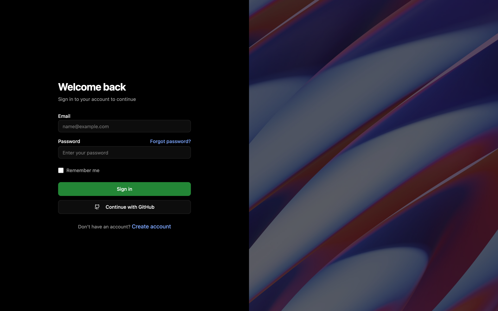

The login screen. The email/password form and "Continue with GitHub" both start the GitHub OAuth flow; there is no local password store.

### Repository picker

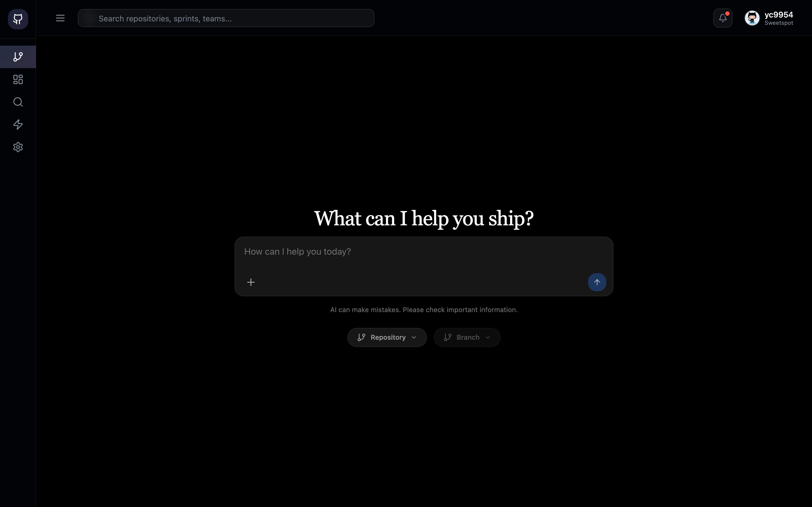

After sign-in you land on `/repository`. Type a question, then choose a repository and branch below the prompt.

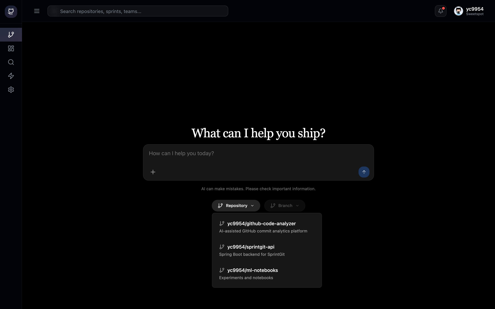

The repository popover lists the repositories linked to your account (`GET /api/users/me/repositories`). Picking one loads its branches from the GitHub API and queues a sync on the backend.

### Commits and AI analysis

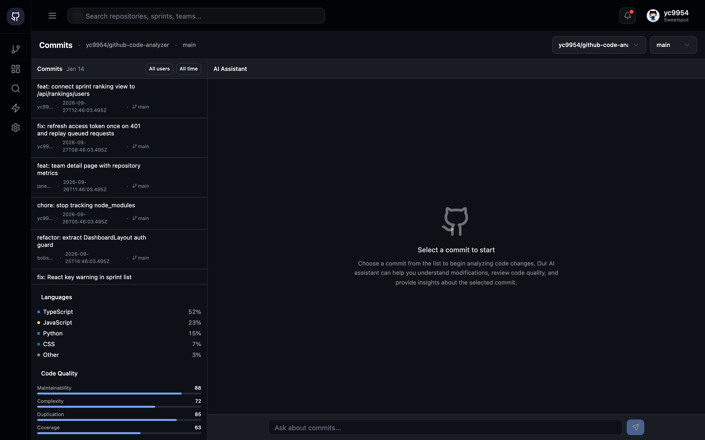

The Commits view: a dense commit list on the left (with language breakdown and code-quality bars) and the AI assistant on the right.

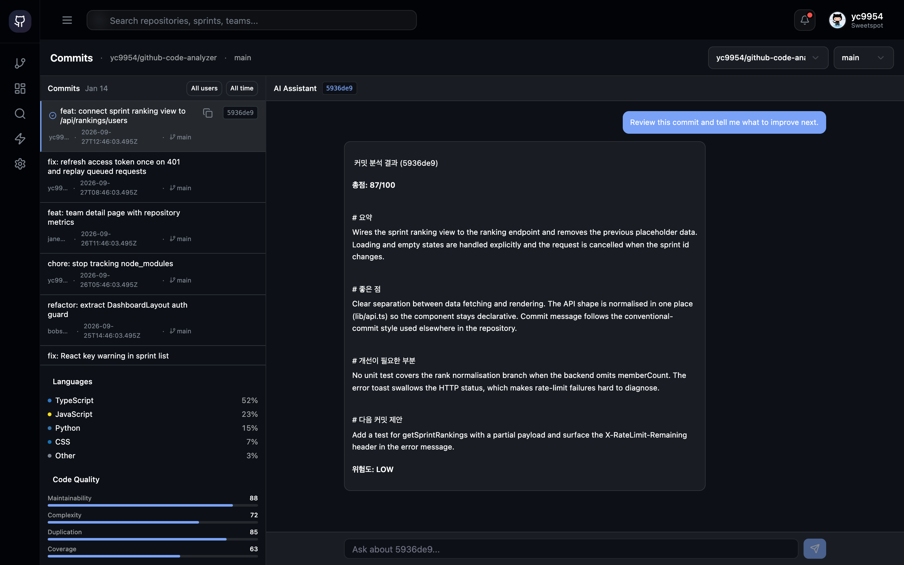

Select a commit and ask a question. The assistant renders the stored analysis for that SHA: total score, summary, strengths, issues, suggested next commit and risk level.

### Dashboard

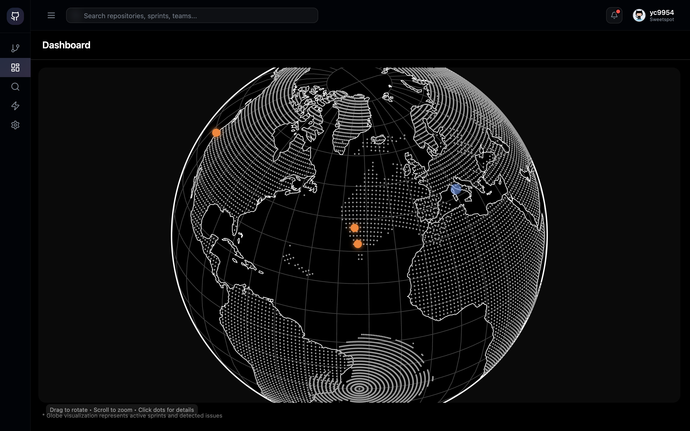

The dashboard globe. Orange dots are detected issues, blue dots are sprints; the globe rotates, zooms and shows details on click.

### Sprints and rankings

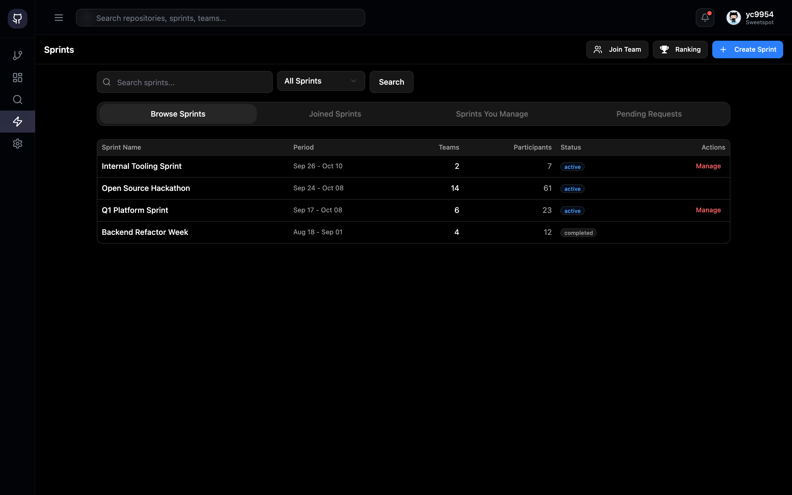

Sprint browser with tabs for all, joined, managed and pending sprints. Managers see a "Manage" action per row.

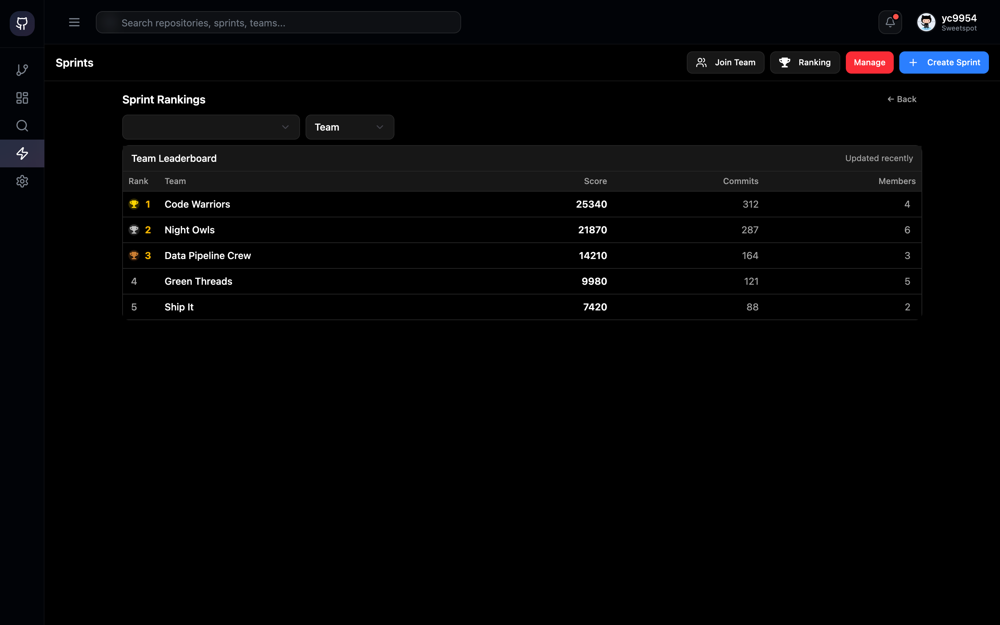

The team leaderboard for a sprint (`GET /api/sprints/{id}/ranking?type=TEAM`). Switch to "Individual" to see the per-user ranking.

### Search

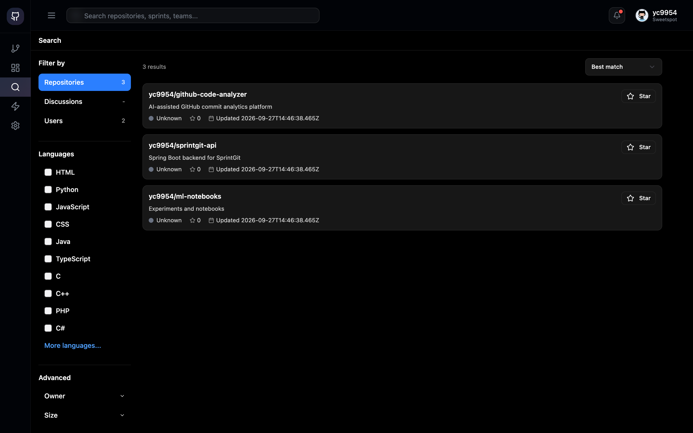

Integrated search with repository/user filters, language checkboxes and sort order.

### Teams

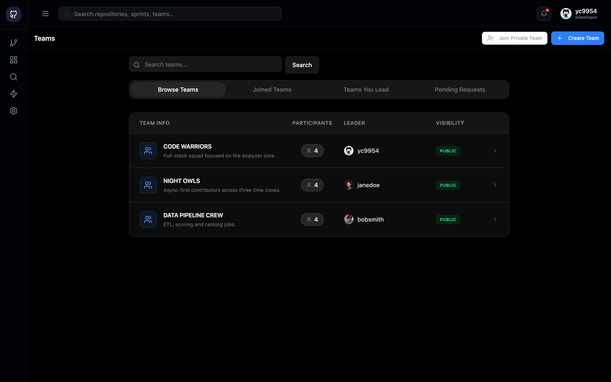

Public teams, teams you joined, teams you lead, and pending requests. "Join Private Team" accepts a team id.

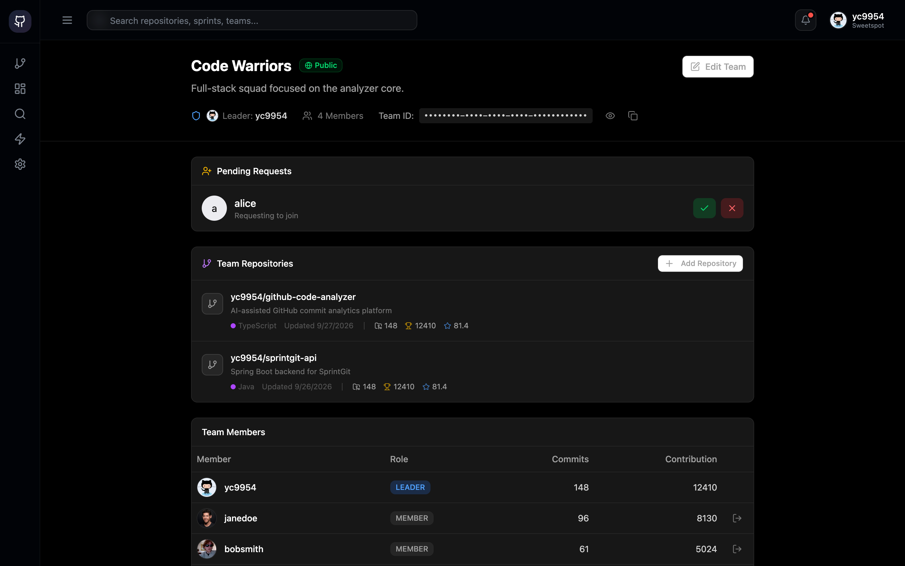

Team detail as seen by the leader: pending join requests with approve/reject, team repositories with commit count, total score and average score, and the member contribution table.

### Settings

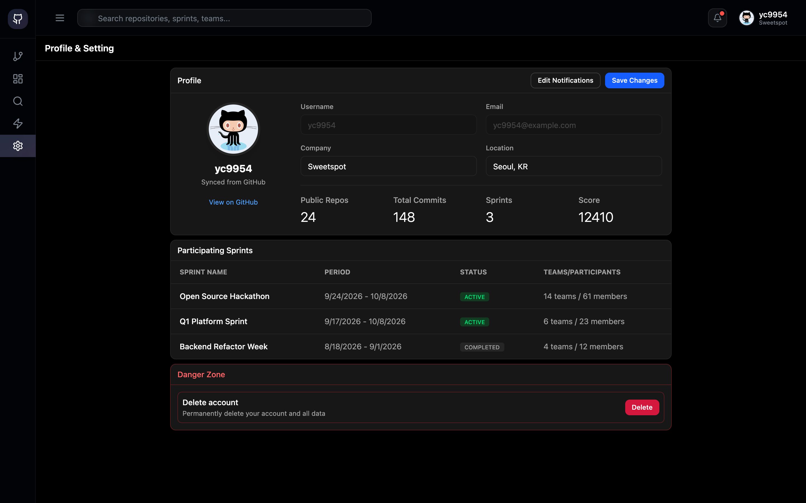

Profile and settings: GitHub-synced profile, editable company/location, notification preferences, participating sprints and the account danger zone.

## Architecture

### Frontend / backend split

```
Browser (Vite SPA, :5173)
  |
  |  fetch(`${VITE_API_URL}/api/...`)  Authorization: Bearer <accessToken>
  |
  +--> https://api.sprintgit.com          (default: SprintGit REST API, OpenAPI in api-docs-v3.json)
  |
  +--> http://localhost:3000              (optional: server/ Next.js proxy)
  |        |
  |        +--> https://api.sprintgit.com   /api/auth/*, /api/users/*, /api/teams/*, /api/sprints/*,
  |        |                                /api/rankings/*, /api/notifications, /api/repos/*/metrics
  |        +--> https://api.github.com      /api/search, /api/repositories, /api/repositories/{o}/{r}/{branches,commits}
  |        +--> https://api.openai.com      /api/chat (gpt-4o-mini)
  |
  +--> https://api.github.com/repos/{owner}/{repo}/branches   (branch list, optional VITE_GITHUB_TOKEN)
```

`src/lib/api.ts` is the single API client. It builds every URL from `VITE_API_URL` (default `https://api.sprintgit.com`), attaches the bearer token from `localStorage`, unwraps the `{ status, message, data }` envelope, records `X-RateLimit-*` headers, and on a 401 refreshes the token once and replays queued requests.

`server/middleware.ts` adds CORS headers for `http://localhost:5173` and `http://localhost:3000` on every `/api/*` response so the SPA can call the proxy from the Vite dev server.

### Authentication flow

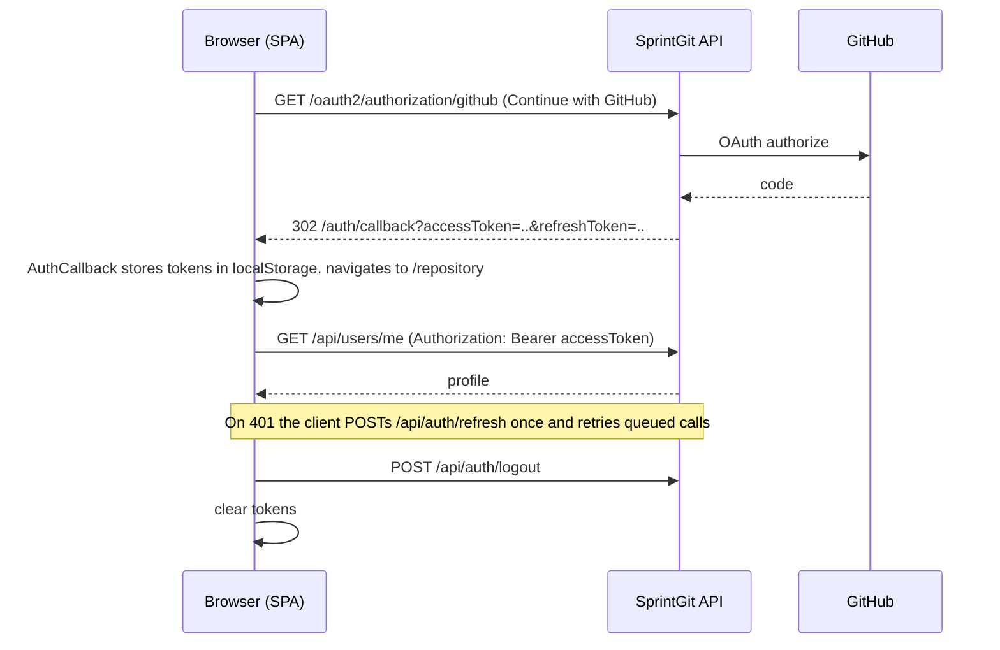

- `src/app/pages/LoginPage.tsx` redirects to `https://api.sprintgit.com/oauth2/authorization/github`.
- `src/app/pages/AuthCallback.tsx` reads `accessToken` / `refreshToken` from the query string (or hash), stores them and redirects to `/repository`. It also handles the GitHub App installation return (`type=installation&installation_id=...&setup_action=install`).
- `src/app/pages/LandingPage.tsx` forwards the same parameters to `/auth/callback` in case the backend redirects to the site root.
- `backend-callback-redirect.html` is a static page you can host on the backend's callback URL; it forwards the tokens to the frontend origin (`http://localhost:5173` by default).
- `src/app/components/DashboardLayout.tsx` guards every authenticated route: if no `accessToken` is present after two short retries it redirects to `/login`.
- `src/app/contexts/UserContext.tsx` loads `GET /api/users/me` once and exposes `user`, `refreshProfile` and `logout` to the tree.

### Data flow for a commit analysis

```
/repository  --(owner, repo, branch, question)-->  /commits
    |                                                  |
    | POST /api/repos/{owner/repo}/sync (background)   | GET /api/repos/{owner/repo}/commits
    |                                                  | GET https://api.github.com/repos/{o}/{r}/branches
    |                                                  |
    |                                   select commit + ask
    |                                                  |
    |                                                  | GET /api/repos/{owner/repo}/commits/{sha}/analysis
    |                                                  v
    |                                   rendered score / summary / issues / next step
```

Analysis is asynchronous on the backend: commits carry `analysisStatus` (`PENDING`, `PROCESSING`, `COMPLETED`, `FAILED`) and the API also exposes `GET /api/repos/{repoId}/commits/{sha}/status` for polling.

### Routes

| Path | Page | Auth |
| --- | --- | --- |
| `/` | Landing | no |
| `/login` | GitHub sign-in | no |
| `/auth/callback` | Token hand-off | no |
| `/repository` | Repository and branch picker with prompt | yes |
| `/commits` | Commit list and AI assistant | yes |
| `/dashboard` | Globe dashboard | yes |
| `/sprint` | Sprints (`?mode=list|participate|ranking|create|manage&sprintId=`) | yes |
| `/ranking` | Redirects to `/sprint?view=ranking` | yes |
| `/search` | Integrated search (`?q=`) | yes |
| `/teams`, `/teams/:teamId` | Teams and team detail | yes |
| `/settings` | Profile and settings | yes |

## API reference

Summarised from [`api-docs-v3.json`](api-docs-v3.json) (OpenAPI 3.1, "GitHub Analyzer API" v1.0.0, server `https://api.sprintgit.com`). All endpoints except the OAuth entry points expect `Authorization: Bearer <accessToken>`; responses are wrapped as `{ "status": "success", "message": "...", "data": ... }`.

### Authentication

| Method | Path | Purpose |
| --- | --- | --- |
| GET | `/oauth2/authorization/github` | Start GitHub OAuth (browser redirect) |
| GET | `/api/auth/test/success` | Displays tokens after login (for Swagger testing) |
| GET | `/api/auth/github/installation` | GitHub App installation return handler |
| POST | `/api/auth/refresh` | Exchange a refresh token for a new token pair |
| POST | `/api/auth/logout` | Invalidate the refresh token |

### User and dashboard

| Method | Path | Purpose |
| --- | --- | --- |
| GET | `/api/users/me` | My profile |
| PUT | `/api/users/me` | Update company, location, notification settings |
| DELETE | `/api/users/me` | Withdraw account |
| GET | `/api/users/me/dashboard` | Streak, total commits, total score, active sprints |
| GET | `/api/users/me/repositories` | Repositories linked to my account |
| GET | `/api/users/me/commits/recent` | My recent commits |
| GET | `/api/users/me/activities/heatmap` | Commit heatmap data |
| GET | `/api/users/{username}/profile` | Public profile (badges, tier, participating sprints) |
| GET | `/api/users/{userId}/repositories/{repoId}/commits` | Commits by a user in a repository |

### Repository and commit analysis

| Method | Path | Purpose |
| --- | --- | --- |
| GET | `/api/repos/{repoId}` | Repository details and language stats |
| GET | `/api/repos/{repoId}/metrics` | Commit count, average score, total score |
| GET | `/api/repos/{repoId}/contributors` | Contributors ordered by commits/score |
| POST | `/api/repos/{repoId}/sync` | Queue an asynchronous sync from GitHub |
| GET | `/api/repos/{repoId}/commits` | Recent commits with analysis status and score |
| GET | `/api/repos/{repoId}/commits/activities` | Alias of the commit list |
| GET | `/api/repos/{repoId}/commits/{sha}/status` | Analysis status (PENDING, IN_PROGRESS, COMPLETED, FAILED) |
| GET | `/api/repos/{repoId}/commits/{sha}/analysis` | Full AI analysis result |
| POST | `/api/webhooks/github` | GitHub webhook receiver |

`repoId` is `owner/repo`, URL-encoded by the client.

### Sprint

| Method | Path | Purpose |
| --- | --- | --- |
| GET | `/api/sprints` | Public sprints (paginated `content`) |
| POST | `/api/sprints` | Create a sprint |
| GET | `/api/sprints/my` | Sprints I joined or manage |
| PUT | `/api/sprints/{sprintId}` | Update a sprint (manager) |
| GET | `/api/sprints/{sprintId}/ranking` | Team or individual ranking (`type=TEAM|INDIVIDUAL`) |
| POST | `/api/sprints/{sprintId}/registration` | Register a team and repository (team leader) |
| POST | `/api/sprints/{sprintId}/registrations/{teamId}/approve` | Approve or reject a registration (manager) |
| POST | `/api/sprints/{sprintId}/registrations/{teamId}/ban` | Ban a team (manager) |

### Team

| Method | Path | Purpose |
| --- | --- | --- |
| POST | `/api/teams` | Create a team (creator becomes leader) |
| GET | `/api/teams/{teamId}` | Team details |
| PUT | `/api/teams/{teamId}` | Update name, description, visibility (leader) |
| GET | `/api/teams/{teamId}/members` | Members with rank, commit count and contribution score |
| POST | `/api/teams/{teamId}/join` | Request to join (join code for private teams) |
| POST | `/api/teams/{teamId}/approve` | Approve a pending member (leader) |
| DELETE | `/api/teams/{teamId}/members/{userId}` | Remove a member (leader) |

### Search, ranking, notifications

| Method | Path | Purpose |
| --- | --- | --- |
| GET | `/api/search` | Integrated search (`q`, `type=ALL|USER|REPOSITORY|TEAM|SPRINT|COMMIT`, `language`, `sort`) |
| GET | `/api/rankings/users` | Top users (`scope=GLOBAL|SPRINT|TEAM`, `period`, `limit`) |
| GET | `/api/rankings/commits` | Top commits (`scope`, `period`, `limit`) |
| GET | `/api/notifications` | Notification history |
| PUT | `/api/notifications/{id}/read` | Mark a notification read |
| GET | `/api/notifications/stream` | Server-sent events stream |

### Local proxy routes (`server/app/api`)

The Next.js server mirrors most of the paths above under `http://localhost:3000/api/...` (auth, users, teams, sprints, rankings, notifications, repository metrics) and forwards them to SprintGit with the caller's `Authorization` header. It adds three routes that are not in the upstream API:

| Method | Path | Purpose |
| --- | --- | --- |
| GET | `/api/search?q=&type=repositories&language=&sort=` | GitHub repository search (uses `GITHUB_TOKEN`); `type=TEAM|SPRINT` is forwarded to SprintGit |
| GET | `/api/repositories` | Placeholder: returns five hard-coded sample repositories (the GitHub call is commented out) |
| GET | `/api/repositories/{owner}/{repo}/branches` | Branch list with commit counts from the GitHub API |
| GET | `/api/repositories/{owner}/{repo}/commits?branch=` | Commit list from the GitHub API (max 20 per page) |
| POST | `/api/chat` | OpenAI `gpt-4o-mini` code review with commit context (uses `OPENAI_API_KEY`) |

## Tech stack

| Layer | Choice |
| --- | --- |
| Build | Vite 6, TypeScript, `@vitejs/plugin-react` |
| UI | React 18, React Router 7, Tailwind CSS 4, shadcn/ui on Radix primitives, MUI, lucide-react, motion |
| Charts and viz | D3 7 (wireframe globe), Recharts |
| Forms and misc | react-hook-form, date-fns, sonner, cmdk, vaul, embla-carousel |
| Backend | Next.js 16 (App Router route handlers, Turbopack dev), React 19 |
| External services | SprintGit REST API (`https://api.sprintgit.com`), GitHub REST API, OpenAI Chat Completions |
| Tooling | concurrently, ESLint (server), Figma Make export |

## Getting started

### Prerequisites

- Node.js 20 or newer and npm
- A GitHub account (sign-in is GitHub OAuth only)
- Optional: a GitHub personal access token and an OpenAI API key for the local proxy routes

### Environment variables

Frontend (`.env` in the repository root, see [`.env.example`](.env.example)):

| Variable | Required | Default | Purpose |
| --- | --- | --- | --- |
| `VITE_API_URL` | no | `https://api.sprintgit.com` | Base URL for all API calls. Set to `http://localhost:3000` to go through the local Next.js proxy. |
| `VITE_GITHUB_TOKEN` | no | none | Token for the direct GitHub branches call (raises the limit from 60 to 5,000 requests/hour). |

Backend (`server/.env.local`, see [`server/.env.example`](server/.env.example)):

| Variable | Required | Purpose |
| --- | --- | --- |
| `GITHUB_TOKEN` | for GitHub routes | Classic PAT with `public_repo` (or `repo` for private repositories). Used by `/api/search`, `/api/repositories/**`. |
| `OPENAI_API_KEY` | for `/api/chat` | OpenAI key; the route returns 500 with a clear message when it is missing. |

No secrets are committed; `.env*` files are git-ignored.

### Install

```bash
git clone https://github.com/yc9954/yc9954-Github-code-analyzer.git
cd yc9954-Github-code-analyzer
npm install
cd server && npm install && cd ..
```

### Run

```bash
npm run dev
```

`concurrently` starts both processes:

| Process | Command | URL |
| --- | --- | --- |
| Frontend | `npm run dev:frontend` (`vite`) | http://localhost:5173 (falls back to the next free port) |
| Backend | `npm run dev:backend` (`cd server && next dev`) | http://localhost:3000 |

You can also run them separately, for example `npx vite --port 5184` and `cd server && npx next dev -p 3010`. If you change the frontend port, add it to `allowedOrigins` in `server/middleware.ts` and to `FRONTEND_URL` in `backend-callback-redirect.html`.

Open the frontend, click "Get Started", sign in with GitHub, and you will be redirected to `/repository`.

### Build

```bash
npm run build            # frontend -> dist/
cd server && npm run build && npm start   # backend
```

## Project structure

```
.
|-- api-docs-v3.json               OpenAPI 3.1 description of the SprintGit API
|-- backend-callback-redirect.html Static OAuth callback page that forwards tokens to the SPA
|-- verify_api.sh                  Smoke test for public and authenticated API endpoints
|-- debug_jsx.py                   Helper that prints <div> nesting depth for a JSX file
|-- guidelines/Guidelines.md       Figma Make design-system guidelines template
|-- index.html                     Vite entry
|-- vite.config.ts                 React + Tailwind plugins, "@" alias to src/
|-- package.json                   Scripts: dev, dev:frontend, dev:backend, build, clean*
|-- docs/screenshots/              Screenshots used in this README
|-- src/
|   |-- main.tsx                   React root
|   |-- lib/api.ts                 Typed API client, token refresh, rate-limit tracking
|   |-- styles/                    Tailwind and global styles
|   |-- assets/                    Static images
|   `-- app/
|       |-- App.tsx                Router and route table
|       |-- contexts/UserContext.tsx
|       |-- hooks/                 use-character-limit, use-image-upload
|       |-- components/            DashboardLayout, Sidebar, TopBar, ResponsiveHeroBanner
|       |   |-- ui/                shadcn/ui components, chat input, globe, activity dropdown
|       |   `-- figma/             Figma Make helpers
|       `-- pages/                 Landing, Login, AuthCallback, Repository, Commits,
|                                  Dashboard, Sprint, Ranking, Search, Team, TeamDetail, Settings
`-- server/
    |-- middleware.ts              CORS for /api/*
    |-- next.config.ts
    |-- README.md                  Backend-specific setup notes
    `-- app/api/                   Route handlers
        |-- auth/{logout,refresh}
        |-- chat                   OpenAI-backed review chat
        |-- notifications
        |-- rankings/users
        |-- repos/[owner]/[repo]/metrics
        |-- repositories, repositories/[owner]/[repo]/{branches,commits}
        |-- search
        |-- sprints, sprints/my, sprints/[id]/{approve,ban,info,ranking,register,registration,registrations}
        |-- teams, teams/{leader,my,public}, teams/[id]/{approve,join,members,repos}
        `-- users/me, users/me/repositories, users/[username]/profile
```

## Development notes

- **`verify_api.sh`** pings the public endpoints (`/api/sprints`, `/api/rankings/users?scope=GLOBAL`, `/api/search?q=demo&type=ALL`) and, when you pass an access token, `/api/users/me` and `/api/users/me/dashboard`:

  ```bash
  ./verify_api.sh                # public endpoints only
  ./verify_api.sh <accessToken>  # also authenticated endpoints
  ```

- **Clean scripts** in `package.json`:

  | Script | Effect |
  | --- | --- |
  | `npm run clean` | Remove `node_modules/.vite` and `dist` |
  | `npm run clean:cache` | Remove the Vite dependency cache only |
  | `npm run clean:all` | Remove caches, `node_modules` and `package-lock.json`, then reinstall |
  | `npm run restart` | `clean:cache` followed by `dev` |

- **`debug_jsx.py`** was used while fixing unbalanced JSX in `SprintPage.tsx`; run `python3 debug_jsx.py src/app/pages/SprintPage.tsx` to print the `<div>` depth around the lines it watches.
- **Direct vs proxied API.** The frontend defaults to calling `api.sprintgit.com` directly. Set `VITE_API_URL=http://localhost:3000` if you want every call to pass through `server/` (useful for logging, or when the upstream CORS policy does not include your origin).
- **Unused pieces.** `RankingPage.tsx` is not routed (the `/ranking` route redirects to the sprint page), `PricingDemo.tsx` is a placeholder, and the language/code-quality widgets on the Commits page are static sample values pending a backend endpoint.
- **Figma Make.** The UI was exported from the Figma Make project "SaaS Developer Analytics UI". Keep both the React and Tailwind Vite plugins even if Tailwind seems unused; `guidelines/Guidelines.md` is the template Make reads for design-system rules.
- **Screenshots.** The images in `docs/screenshots/` were captured with Playwright against the dev server with API responses stubbed at the network layer; no application code was modified for them.

## Project status

**Working today.** Login, repository picker, commits with stored AI analysis, sprints, rankings, teams, search, notifications and settings all run against the hosted SprintGit API. The client handles token refresh and records rate-limit headers. The Next.js layer proxies auth, user, team, sprint, ranking and notification calls and adds GitHub search, GitHub branch/commit listing and the OpenAI chat route.

**Not in this repo.** The SprintGit backend itself (`https://api.sprintgit.com`, described by `api-docs-v3.json`). If that service is unreachable, only the GitHub- and OpenAI-backed routes in `server/` still work, and the authenticated pages show empty states.

**Placeholder data.** `server/app/api/repositories/route.ts` returns five hard-coded sample repositories instead of calling GitHub (the frontend uses `/api/users/me/repositories` on SprintGit instead). The Languages and Code Quality widgets on the Commits page are constants in `CommitsPage.tsx`. The GitHub branches proxy falls back to sample branches on 403/404. The last integration commit before this README was labelled "frontend api connection 70%".

**Tests and CI.** There is no test suite and no CI workflow yet.

## Roadmap

- Wire the Commits page language and code-quality widgets to `GET /api/repos/{repoId}` and `/metrics`.
- Show per-commit sub-scores (message, code quality, testing, risk) as a chart instead of text.
- Subscribe to `GET /api/notifications/stream` (SSE) for live analysis-complete toasts.
- Use `GET /api/repos/{repoId}/commits/{sha}/status` to poll while an analysis is `PENDING` or `PROCESSING`.
- Commit rankings view on top of `GET /api/rankings/commits`.
- Make the backend proxy base URL configurable instead of hard-coding `https://api.sprintgit.com` in each route handler.
- Replace `alert()`/`confirm()` with the existing toast and dialog components; move remaining Korean UI strings behind an i18n layer.
- Tests: API client unit tests (token refresh, envelope unwrapping) and Playwright smoke tests for the main flows.

## License

MIT. A `LICENSE` file has not been committed yet; adding one (MIT text, copyright yc9954) will make the grant explicit.

Third-party components and images are listed in [ATTRIBUTIONS.md](ATTRIBUTIONS.md) (shadcn/ui under MIT, photos from Unsplash under the Unsplash license). The original design is available in Figma: [SaaS Developer Analytics UI](https://www.figma.com/design/rn4hQiMl986ZUFuh5E7hdr/SaaS-Developer-Analytics-UI).
